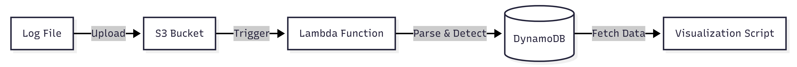
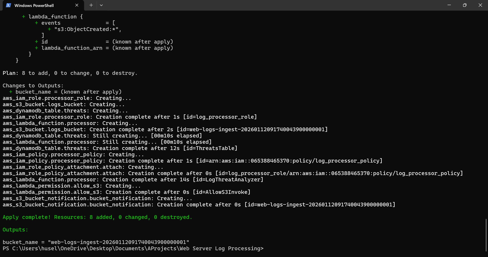
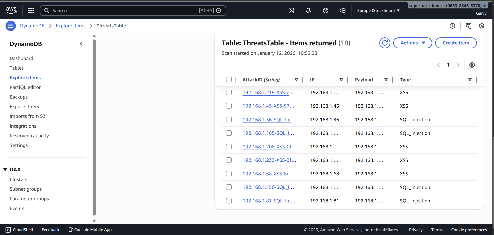
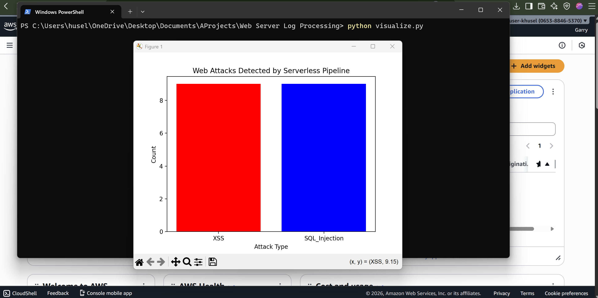

# Serverless Web Log Forensics 🛡️


## Project Overview
A fully automated, serverless pipeline that detects web attacks (SQL Injection, XSS) in real-time. It uses **Infrastructure as Code (Terraform)** to provision resources and **AWS Lambda** to process logs immediately upon upload to S3.

### Architecture


---

## Features
* **Event-Driven Architecture:** No servers to manage; code runs only when data arrives.
* **Infrastructure as Code:** Entire stack (S3, IAM, Lambda, DynamoDB) deployed via Terraform.
* **Pattern Matching:** Custom Regex engine to identify malicious payloads.
* **Data Visualization:** Python script to render threat intelligence dashboards from live data.

---

## Implementation Details

### 1. Infrastructure (Terraform)
Automatic provisioning of the full stack (S3, Lambda, DynamoDB, IAM Roles).


### 2. Detection Logic (Lambda)
The system parses Apache/Nginx logs line-by-line looking for signature-based threats.
* **SQL Injection:** `UNION SELECT`, `' OR '1'='1`
* **XSS:** `<script>`, `javascript:`

### 3. Storage & Analytics (DynamoDB)
Threats are extracted and stored structurally for analysis.


### 4. Intelligence Dashboard
A local Python script queries DynamoDB to visualize attack distribution.


---

## How to Run

### Prerequisites
* AWS CLI configured
* Terraform installed
* Python 3.x

### Deployment
```bash
cd infrastructure
terraform init
terraform apply -auto-approve
```
### Simulation
Generate Traffic:

```bash

python scripts/generate_logs.py
Upload to S3:
```
```bash

aws s3 cp web-server.log s3://<YOUR_BUCKET_NAME>/
Visualize Results:
```
```bash
python scripts/visualize.py
```
